```{r setup, include=FALSE}
knitr::opts_chunk$set(echo = FALSE)
```

# 1.	The original visualization
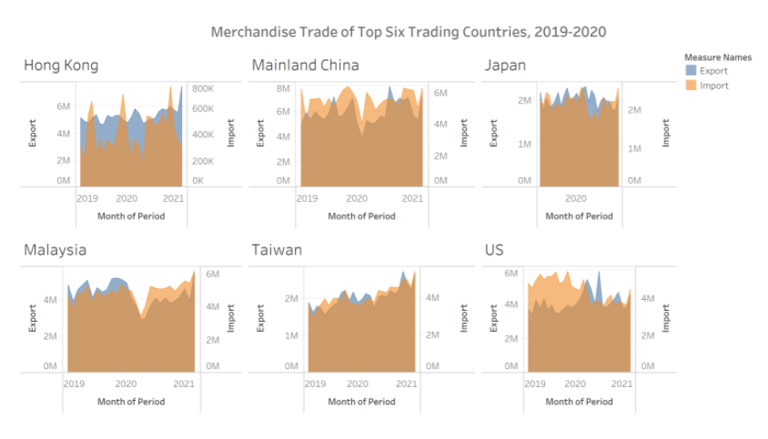
The original visualization is based on the data of [Department of Statistics, Singapore (DOS)](https://www.singstat.gov.sg/find-data/search-by-theme/trade-and-investment/merchandise-trade/latest-data) and trying to reflect the import and export of merchandise trading of top six trading countries between 2019 to 2020.

# 2.	Critiques on Clarity and Aesthetics

For the original charts, there are some mistakes in clarity and aesthetics aspects. The critiques and suggestions are listed as below:

For the clarity:

```{r}
critiques <- data.frame(Item = c(1,2,3,4,5,6), 
                        Critique = c("Chart title not prices - The title “Merchandise Trade of Top Six Trading Countries, 2019-2020” can’t reflect the country and measurement of this chart clearly.",
                                                            "Y axis labels are different – The labels of export and import are different and can’t reflect the difference between export and import clearly.",
                                                            "Data missing – Merchandise trading data of Japan only have the data of 2020.",
                                                            "Merchandise trade order – The order of the countries’ charts can’t reflect clearly which country has the largest import and export trading with Singapore.",
                                                            "Lacking money units – From this chart, we can’t find the units of merchandise trade. It will make readers to get confused.",
                                                            "Wrong title selection for “top six” - After calculation of total trade volume, we can find that these six countries are not the top six."),
                        Suggestion = c("Change the title into “Import and export trade volume of Singapore's six trading countries”.","Y axis labels should keep the same which can easily for readers to recognize.",
"Should keep the data available from 2019 to 2020 for every country.","Should sort the charts to reflect the order of top six countries.","For the Y axis title, it should contain the “($)” to reflect the units of currency.","Change the title")
)
library(knitr)
kable(critiques,align = "ccc")
```
For the aesthetics:

```{r}
aesthetics <- data.frame(Item = c(1,2,3,4),
                         Critique = c("Lack caption – There is no caption in the bottom of the chart. The readers don’t know where the data come from.",
                                      "Chart title’s font size – The chart title should be bigger to attract reader’s attention.",
                                      "Width of charts are different – Charts of Malaysia and Mainland China have wider X axis compare to the other countries. Since the X axis all reflect the same period, width of charts should be same.",
                                      "Lack of annotation to describe the data trend."),
                         Suggestion = c("In the bottom of the chart, we should add the data source as the caption.",
                                        "For the title, we should use bigger font size the color to attract audience attention.",
                                        "For the same time period of X axis, we should use the same width of each chats.",
                                        "Add annotation into the chart about important trend."
                         ))
library(knitr)
kable(aesthetics,align = "ccc")

```

# 3.	Proposed Design

## 3.1 Sektch

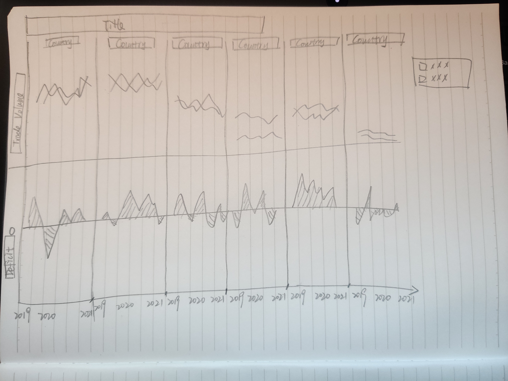

## 3.2	Advantage of proposed design

The advantages of the new design are as follow:

- Title shows that the chart reflects the import and export trade volume and trading country Singapore clearly.
- The different and correspond color of “import” and “export” in the title can easily let readers recognize the color of line chart and know which lines represent import trade volume and export trade volume.
- Sort countries based on the total trade volume can let readers easily to read.
- Keeping the Y axis same for all six countries can help readers to compare the trade data easily.
- Separating the Y axis for two charts of absolute trade volume and deficit which is the difference between import trade volume and export trade volume.

# 4.	Data Visualization Process

## 4.1 Data Preparation

1. We should delete the data of all countries which is not in the period of 2019 to 2020. 
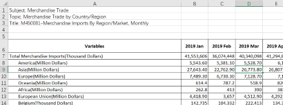
2.	We select the six countries’ trading volume data and import into a new dataset.
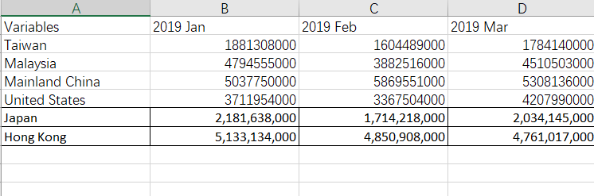
3.	We should select the data of top six countries forming a dataset and import the dataset into Tableau.
4.	The data from 2019 to 2020 are spread across multiple rows. To create a flat dataset, we can use the “Pivot” function.
5.	Rename the headers. We rename the headers into “Month of Period_Import” and “Import Value” for import trade volume data.
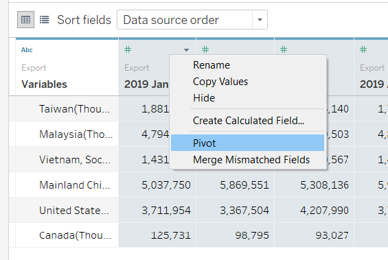
6.	Change the type of data into “Date”
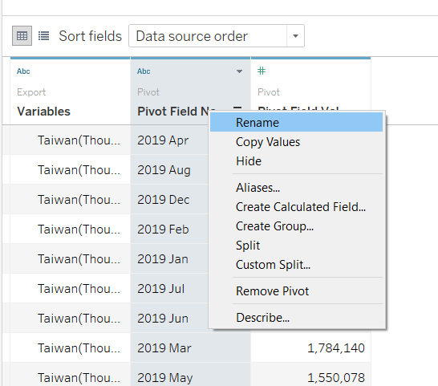

## 4.2	Data Visualization

1.	Create line chart
To create the line chart, we should first drag [Country_Export], [Measure Values] and [YEAR (Month of Period_Export] to the column and row.
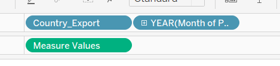

To create the chart with the continuous time, we should change the [YEAR (Month of Period_Export] into the continuous format.

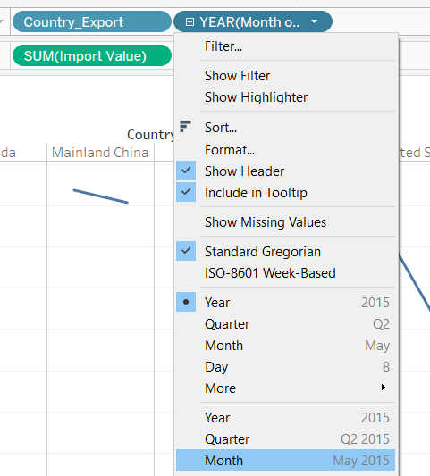

Then the first part of chart is completed.
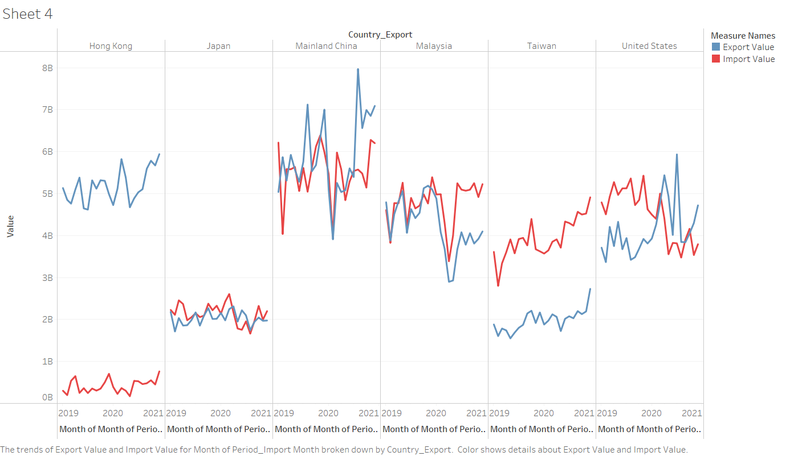
2.	Create “Balance of Trade“
For import and export trade volume, deficit is a critical factor for evaluation. Therefore, we create a calculated field and use the function to calculate it.

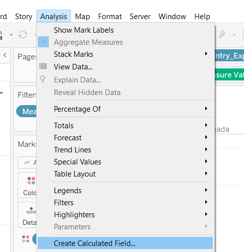

The formula of "Balance of Trade" is "[Export Value] - [Import Value]"

3.	Create area chart for deficit
After calculation of deficit, we drag [SUM (Balance of Trade)] to the row for twice and set the Y axis range for positive and negative.

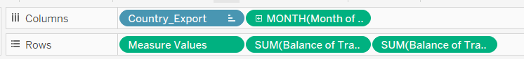

For the two parts of "Balance of Trade":
We will set the range of one of them is fixed to positive and the other fixed to negative:
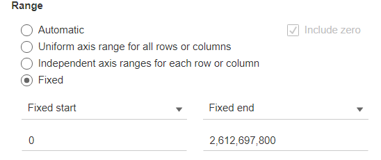 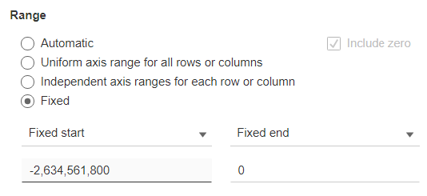

4.	Apply color
Set the color according to the positive and negative data. For the positive data, we set the color to red and set the color to blue for negative data.
For the positive part:
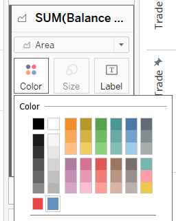 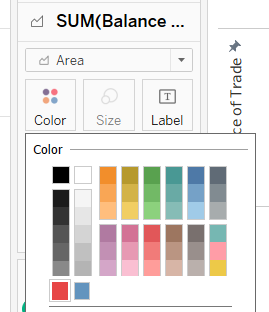

5.	Hide the title of X axis
Double click the X axis title and delete them to hide the repeat title.
6.	Add the title
Add title “Import and export trade volume of Singapore's top six trading countries” and set the color of word “import” and “export” according to the line chart.
7.	Add the annotation
Add the annotation for Taiwan and Hong Kong.
Taiwan: Import trade volume was always higher than its export
Hong Kong: Export trade volume was always higher than its import
8.	Add the caption
Add the caption: The data is from the Department of Statistics, Singapore(DOS)

# 5.	Final Visualization

## 5.1 Snapshot of Final Chart
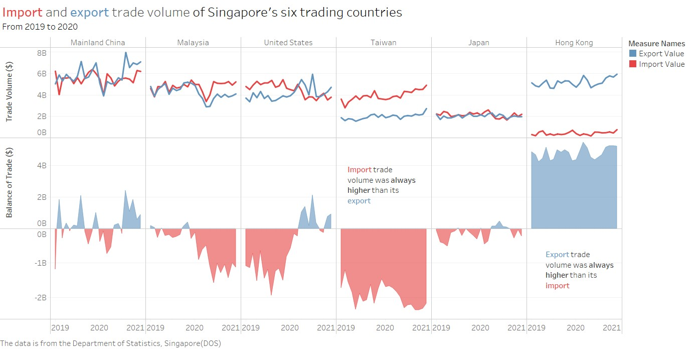

## 5.2	Observations
-	The surplus and deficit in the import and export trade between Singapore and China always cross and the surplus is always greater than the deficit
-	The international trade between Singapore and the United States will be dominated by a deficit in 2019, and will be dominated by a surplus in 2020. Generally speaking, the total deficit is greater than the total surplus.
-	For trade to Taiwan, the import trade volume has always been higher than export trade volume which means there is high deficit between Taiwan and Singapore.
-	For trade to Hong Kong, the import trade volume has always been lower than export trade volume which means there is high trade surplus between Hong Kong and Singapore.
-	From 2019 to 2020, the import and export trade volume between Singapore and China, the United States, and Malaysia fluctuates greatly over time. In contrast, the import and export trade volume between Singapore and Hong Kong, Taiwan and Japan is relatively stable.


