```{r setup, include=FALSE}
knitr::opts_chunk$set(echo = FALSE)
```

# 1. Original Visualization


The [original visualization](https://www.singstat.gov.sg/modules/infographics/singapore-international-trade) is based on the data of merchandise trade performance with major trading partners in 2020. The data source is [Department of Statistics, Singapore (DOS)](https://www.singstat.gov.sg/find-data/search-by-theme/trade-and-investment/merchandise-trade/latest-data). Apart from the chart of trading data, there are also some notes for explain of image comprehension and annotation for trading data analysis. 

# 2. Critiques & Suggestions

## 2.1 Clarity

- **_Improper labeling and formatting for X – axis and Y – axis:_**  Since the minimum value for both exports and imports is zero, it is unreasonable not to have zero at the origin of coordinate axis. The area when export and import values are all negative is not existing in reality. Therefore, the origin of coordinate axis should be zero.

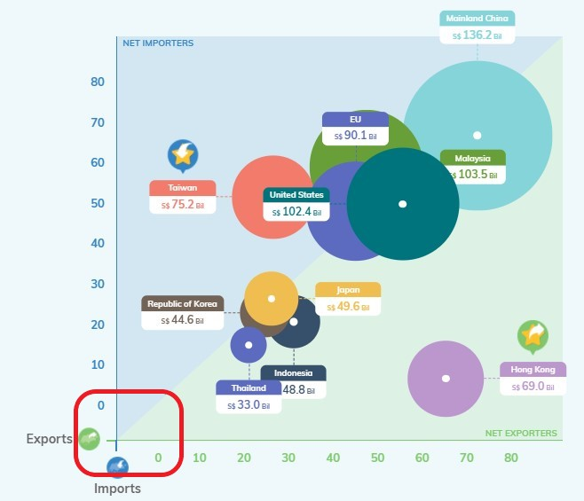
Moreover, for the label of X-axis and Y-axis, there is no unit of measurement of currency which will make readers confused about the value and amount of transaction of exports and imports. Therefore, the labels for X-axis and Y-axis should be “Export (Billion Dollars)" and “Import (Billion Dollars)".

- **_Improper annotation:_**  Annotation only comprised by the country names and numbers. There is also no explanation in the notes for numbers of annotation. This will make readers confused about the meanings of numbers. From the information of this image, these data might represent the total transaction values, net exports values, net imports values, exports or imports. Therefore, the note should also explain the meaning of numbers in annotation.

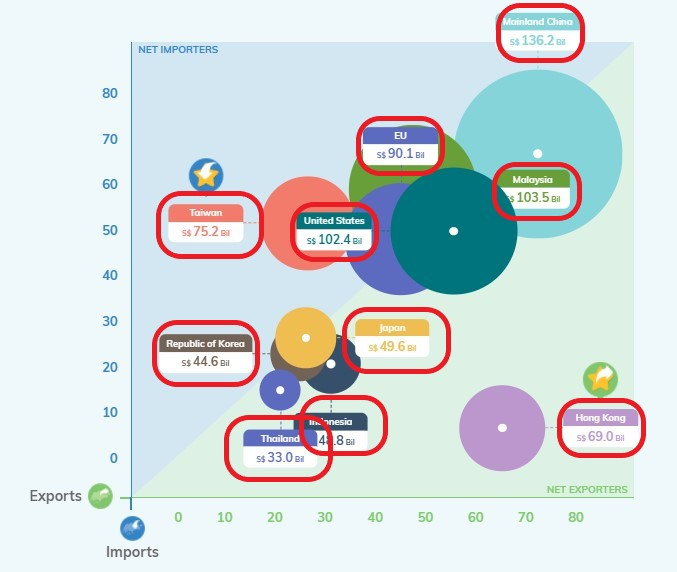

- **_Improper description of chart:_**  Since the data in this chart is from 2020, it is unreasonable to describe the trend of balance of trade between Singapore and Mainland China and United States from 2009 and 2006. Therefore, the description should focus on the trend or data of 2020.

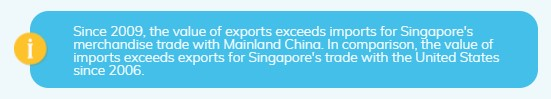

## 2.2 Aethetics

- ***Similar colors of two regions:***  Since the author chose to use different colors represent different countries, it is inappropriate to use similar colors to represent two regions. It is hard for readers to distinguish the colors that represent Thailand and EU. Therefore, it is necessary for us to change the color represents Thailand or EU.

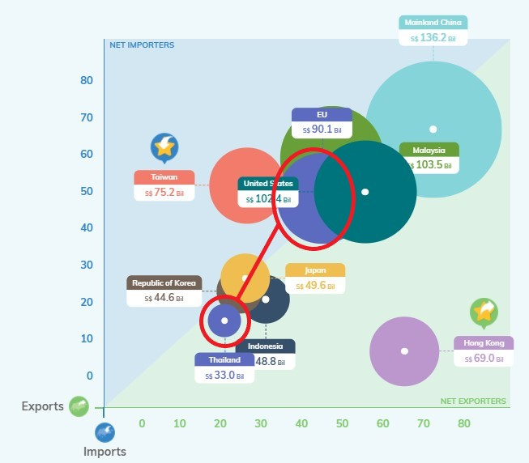

- ***Improper settings for circles:***  Since there are some countries have close exports and imports, there are overlaps between countries. Moreover, the diagonal of chart is not obvious enough for readers to judge these countries to be net exporters or net importers. For the circle represents Korea, it is hard for readers to recognize whether it is the net exporter or net importer. And for the circles represent Japan, Malaysia and EU, they are also covered by the other countries’ circles or the small circles of them are near the diagonal which makes readers hard to recognize. Therefore, we can set the transparency of circles to fix this problem.

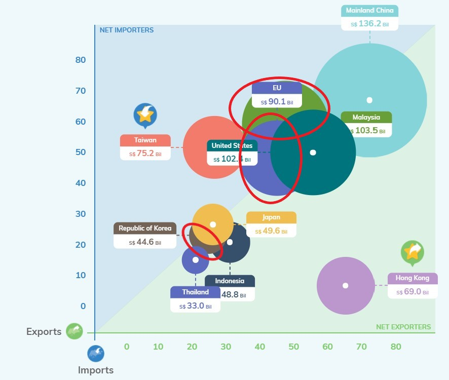

- ***Improper choice of bubble chart:***  Since it is hard for readers to compare the size of circles, it is a bad decision to use circles’ size to represent the transactions values. For the countries have close transaction values, it is hard for readers to recognize which are bigger trading partners with Singapore. Therefore, we can change the charts’ type.

# 3. Proposed Design

## 3.1 Sektch


## 3.2 Final Design

The final design by using Tableau is as follow [(Tableau Public)](https://public.tableau.com/app/profile/zhen.li7736/viz/makeover2_16241157051710/makeover2):

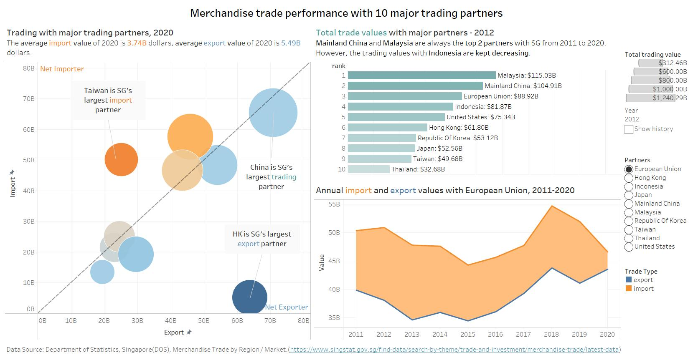

## 3.3 Advantage of Proposed Design

- ***X-axis and Y-axis:*** For all the x-axis and y-axis in the dashboard, we make sure all the data have "B" as the unit of measurement for the trading value of imports and exports. Moreover, we set 0 as the origin of coordinate axis of "Trading with major trading partners, 2020". To make the trend of balance of trade to be more obvious, we set the Y-axis of "Annual import and export values with partner, 2011-2020" not include the 0 value.

- ***Better annotations:*** For the unclear annotations of original design, we delete all the annotations for different countries and create the annotations for countries who are largest net importer, largest net exporter and largest total trading value. In this way, readers can better focus themselves on the important parts and not distracted by too many annotations and colors. 

- ***Simple but powerful colors:*** For the complicated and too many colors in the original design, we change them into three major colors for the whole dashboard. Orange represent the import and deficit. Blue represent the export and surplus. Green represent the total trading value. By doing this, readers can easily understand the information from charts and don't need to recognize each country from many different colors by looking at the legend.

- ***Interactive design:*** In the final design, we use the filters and animations to make the dashboard more interactive. By these filters, readers can choose the country to see the trend of imports, exports and balance of trade values. Also, by using animations, readers can observe the changing in the ranking of these 10 major partners in terms of total trade values with Singapore from 2011 to 2020.

# 4. Main Observations

{width=70%}

- **Mainland China:** Since 2013, Mainland China has been the largest trading partners with Singapore. From 2011 to 2020, Singapore’s annual export trade value with China is always greater than its annual import trade value. The trade balance between China and Singapore reached its largest in 2015, but both the import and export trade volume and the trade balance fell sharply in 2016. The same situation also appeared in 2017 and 2018. The export trade volume reached its highest point in 2017, but the import and export volume fell sharply in 2018. Of the two sharp declines, the export value was the most affected. The import trade volume will see a significant decline in 2020 due to the impact of the new crown epidemic.

{width=70%}

- **United States:** From 2011 to 2020, the United States has played an increasingly important role in the pattern of Singapore’s foreign trade. The ranking has risen from fifth in 2011 to third in 2020 and there has been no decline in the ranking during this decade. Between 2011 and 2020, Singapore’s export trade volume to the United States has risen sharply twice in 2018 and 2020. The import trade volume has experienced two sharp declines in both 2016 and 2020. And there will be a trade surplus for the first time in 2020. This is probably due to covid-19. The balance of trade between United States and Singapore is always large from 2011 to 2019.

{width=70%}

- **Malaysia:** Malaysia has been Singapore's largest trading partner in 2011 and 2012, but was overtaken by China in 2013 and remained Singapore's second largest trading partner until 2020. In 2014, the volume of export trade experienced a substantial decline and showed a declining trend until 2016. Since 2017, the volume of import and export trade began to rebound and maintained an upward trend until 2019. From 2019 to 2020, the export trade volume has dropped significantly, the import trade volume has risen slightly, and the trade deficit has appeared for the first time. The trade balance between Malaysia and Singapore reached its lowest in 2017. And it has a trade surplus from 2011 to 2019.

{width=70%}

- **Indonesia:** The trade volume between Indonesia and Singapore has shown a downward trend, from the fourth place in 2011 to the eighth place in 2020, and there is no increase in the ranking during the period. However, the trade balance between Indonesia and Singapore has always been maintained at a relatively large value, and the trade surplus has been maintained from 2011 to 2020. Since 2018, the trade surplus has also been declining year by year. The most affected in trade is the export trade volume, while the import trade volume is relatively stable. From 2011 to 2016, the export trade volume continued to decline, and it started to rebound in 2017 and saw a significant increase in 2018. However, the downward trend continues in 2019 and 2020.


# 5. Data Visualization Process

## 5.1 Data Preparation

1. Using the filter function in Excel to choose to 10 major partners of imports and exports. Then combine them together.

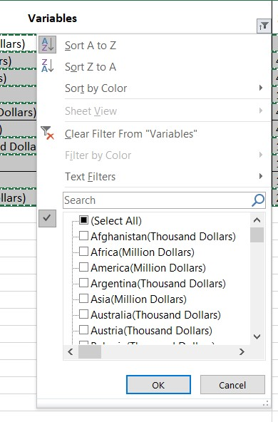{width=30%}{width=45%}

2. Delete the data outside of 2011-2020. Because the unit measurement of different countries are different, we need to use the formula to calculate the new trading values to prepare the data for Tableau.


3. Using Excel to calculate the annual imports and exports. Then create a new sheet for them.


4. Import the data into Tableau.

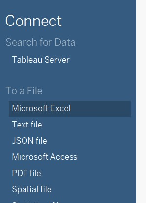{width=25%}

5. Split the variables to get the partners name without brackets.

{width=40%}{width=50%}

6. Using Pivot function to convert data from rows into columns.

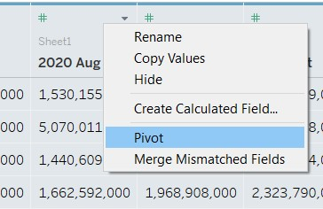{width=55%}

7. Change the data type of time and rename the columns.

{width=30%} 
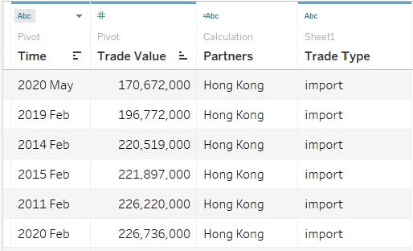{width=60%}

8. Connect the annual data and original data together by variables.


9. Repeat the same steps of split, pivot, changing data types and rename for the original data.

## 5.2 Annual Import and Export Visualization

1. To build this chart, we should first create a new calculating field for the lower value of imports and exports.

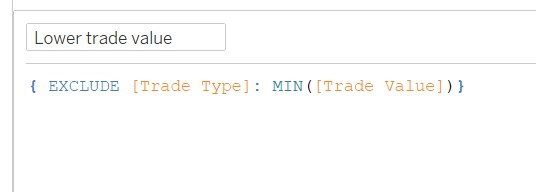{width=70%}

2. We need to drag year to the columns and drag trade value annual and lower trade value to the rows. To make the time continued, we need to choose the year below.

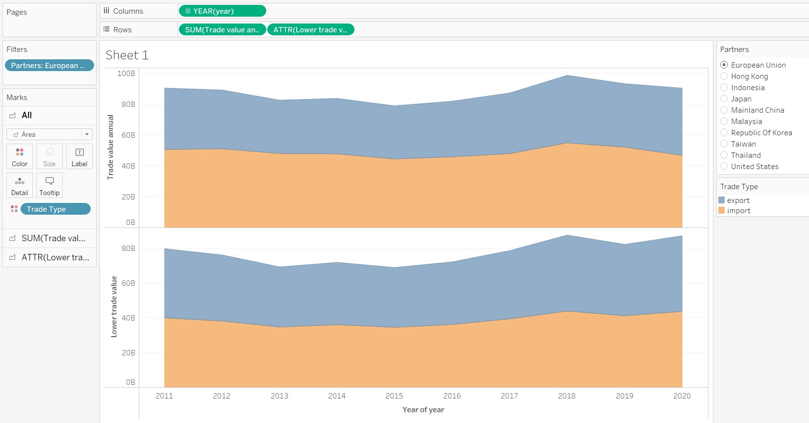

3. Drag lower trade value to the Y-axis of sum(trade value annual) and choose "Area" as the chart type. Then drag sum(trade value annual) to the second axis and choose the "Line" as the chart type.

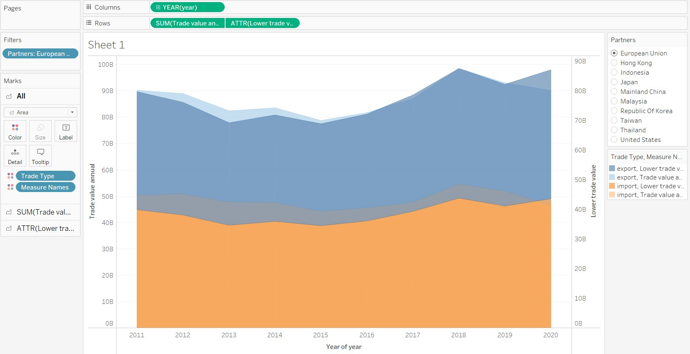

4. Set the color of "export, Lower trade value" and "import, Lower trade value" to be white. Change the "Opacity" of color to 100%. 

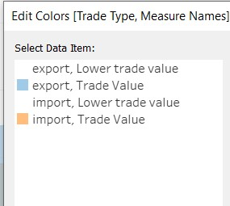{width=40%}

5. For the second Y-axis, we should right click it and choose "Synchronize Axis" and "Show Header" to hide it.


6. Set the title:

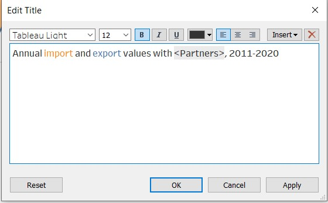{width=60%}

7. The chart is finished!

{width=60%}

## 5.3 Trading Performance in 2020 Visualization

1. Because this chart is mainly focus on the data of 2020, we should first set the filter for time.

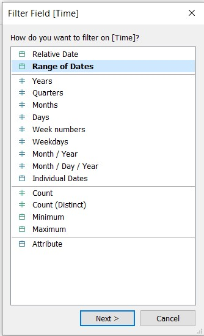{width=30%} 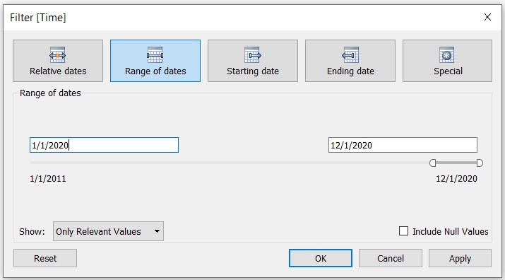{width=60%}

2. Create the new calculation field for export,import and balance of trade values in 2020.

{width=70%}

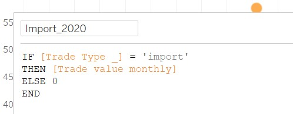{width=70%}

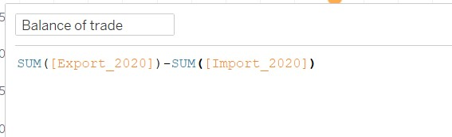{width=70%}

3. Drag the export to the columns and import to the rows. Then choose the circle to be the chart type.

4. To get the diagonal line, we should first create a new calculation field.

{width=70%}

5. To add in the diagonal line, we need to drag "reference line" to the second axis of this chart.

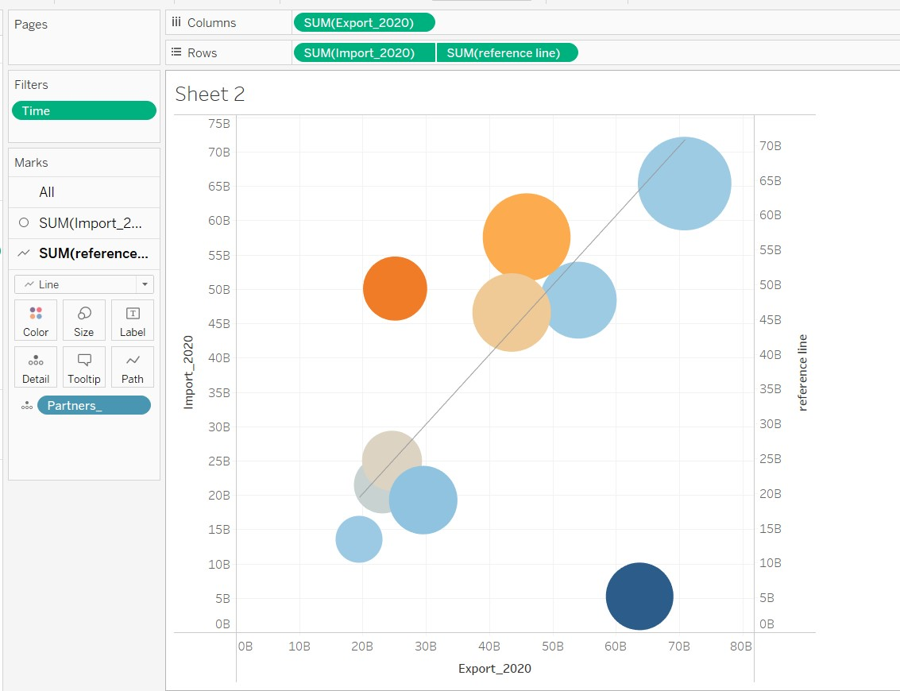

6. To make the reference line extend, we choose "Show Trend Lines" to make it more extendable. Then we choose the "Synchronize Axis" to make the Y-axis range same.

{width=50%} {width=40%}

7. Set the opacity of reference line to 0%.

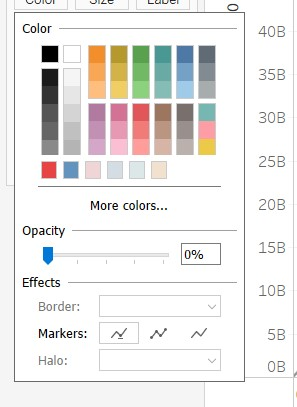{width=30%}

8. Set the range of X-axis and Y-axis to be the same.

{width=50%} 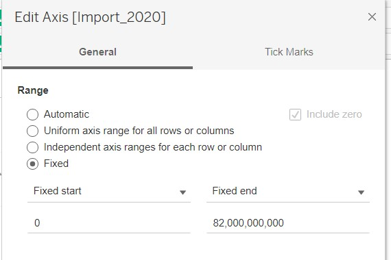{width=50%}

9. To improve the interactive part, we create the new calculation field of deficit and surplus.

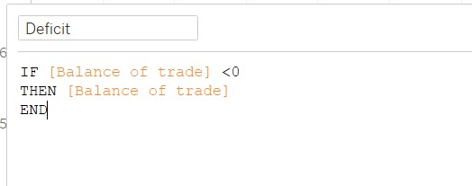{width=50%} 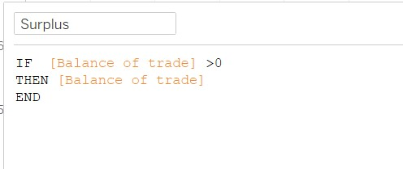{width=50%}

10. Drag the deficit and surplus into the Tooltip and edit them like following:

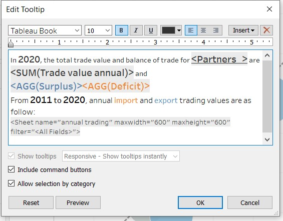{width=60%}

11. To change the unit measurement of the numbers, we right click the circle and choose "Format". From the "Fields", we choose the variables that we want to edit. 

{width=40%} {width=40%}

12. Choose the format of numbers

{width=70%}

14. Set the title: "Trading with major trading partners, 2020
The average import value of 2020 is 3.74B dollars, average export value of 2020 is 5.49B dollars.

15. Set the annotation for the largest net importer, largest net exporter and largest trading partner.

16. The chart is finished!

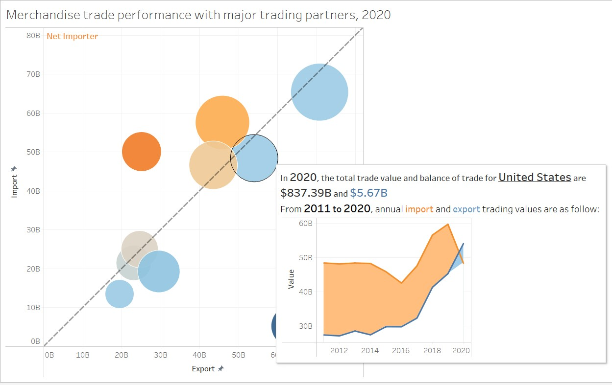


## 5.4 Total Trade Visualization

1. Set the rank to arrange the total trade value descendingly.

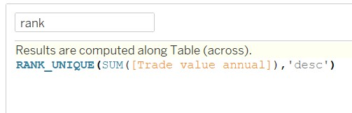{width=70%}

2. Drag the sum(Trade value annual) to the columns and rank to the rows.

{width=50%}

3. For rank, choose the "Discrete" and "Partners" for "Computing Using".

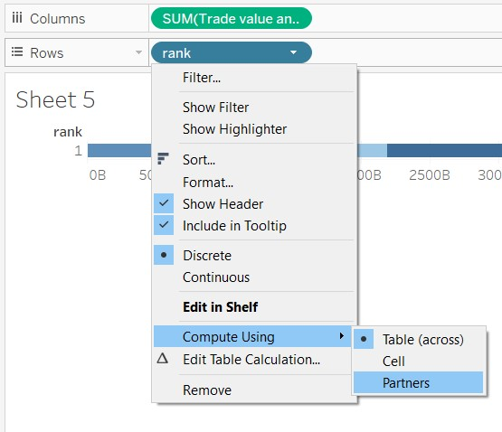{width=50%}

4. To polish the chart, we should drag the sum(Trade value annual) to the color. For tooltip and label, it should be look like the image below:

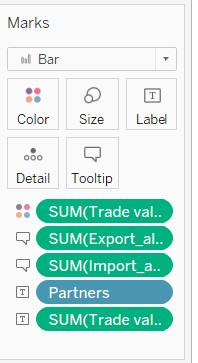{width=25%} {width=50%}

5. Set the title: "Total trade values with major partners - <Page Name>
Mainland China and Malaysia are always the top 2 partners with SG from 2011 to 2020. However, the trading values with Indonesia are kept decreasing."

7. To set the animation, drag the year to the page and turn on the animation.

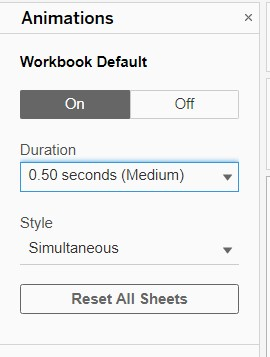{width=40%}

6. The chart is finished!


## 5.5 Dashboard

1. Set the title for dashboard: "Merchandise trade performance with 10 major trading partners"

2. Add the data source in the bottom of dashboard: "Data Source: Department of Statistics, Singapore(DOS), Merchandise Trade by Region / Market.(https://www.singstat.gov.sg/find-data/search-by-theme/trade-and-investment/merchandise-trade/latest-data)"

3. Arrange the location of charts properly and finish the dashboard.


