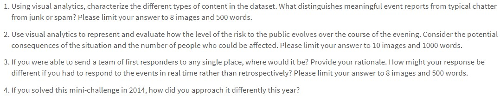
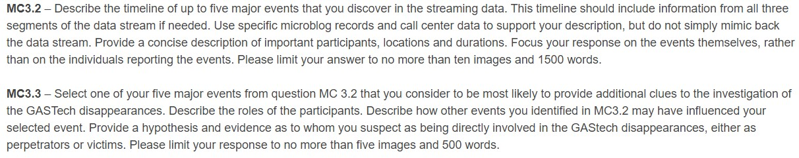
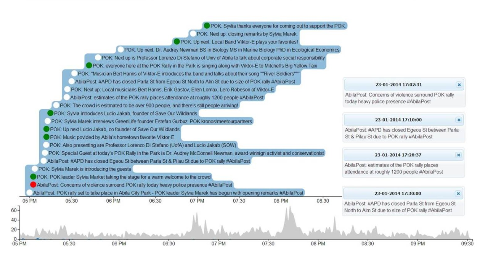
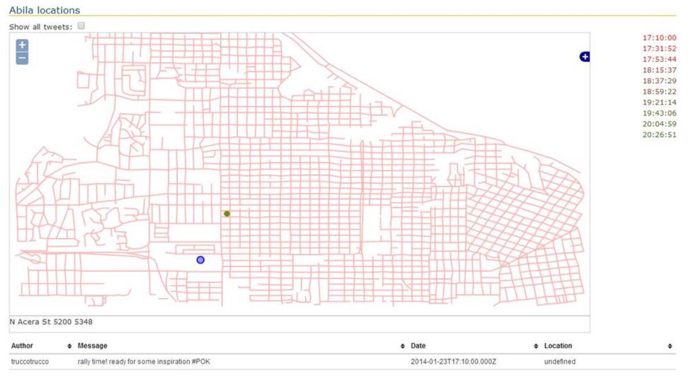
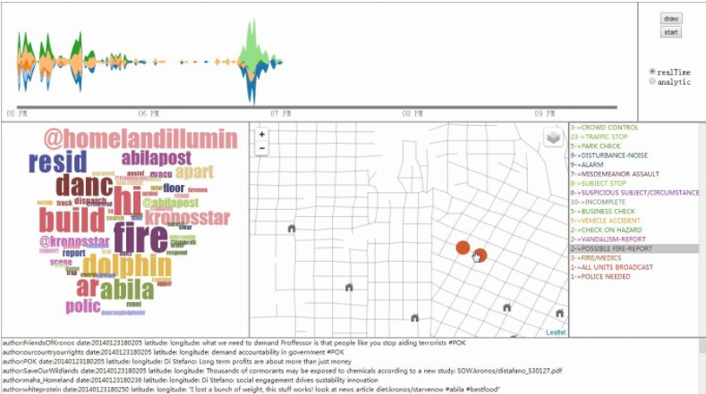

```{r setup, include=FALSE}
knitr::opts_chunk$set(echo = TRUE, message = FALSE)
```
# 1. Introduction

The [2021 IEEE Visual Analytics Science and Technology (VAST) Challenge](https://vast-challenge.github.io/2021/MC3.html) brings back a classic challenge of 2014 with different questions. This is about a crime incident which is a kidnapping GAStech's employees.

In the last 20 years, GAStech has brought remarkable profits to the island country of Kronos by product natural gas. Therefore, they also built strong relationships with the government of Kronos. Although GAStech was very successful, their business model hurt environment of island hugely and arouse dissatisfaction among those who advocate environmental protection.

In January, 2014, the leaders of GAStech are celebrating their new-found fortune as a result of the initial public offering of their very successful company. In the midst of this celebration, several employees of GAStech go missing. An organization known as the Protectors of Kronos (POK) is suspected in the disappearance, but things may not be what they seem.

We will use visualization tool, R, to help analyze the crime and answer the questions below:

{width=800}

# 2. Literature Review 

Since the VAST challenge 2014 had the same situation, the literature review will be conducted based on the research before. However, the questions are different between 2021 and 2014. The questions of 2014 are as following:



For the solutions provided by [Middlesex University](https://www.cs.umd.edu/hcil/varepository/VAST%20Challenge%202014/challenges/MC3%20-%20Real-Time,%20Streaming%20Social%20Media/entries/Middlesex%20University/), they listed the events that need further investigation and the amount of messages during the 3 hours. They also build the geographic image showing the location of events based on the Ablia map. They chose the 'Apartment Fire' as the event which most likely to provide additional clues to investigation. Then they listed all the messages relevant to apartment fire and build the map to show locations of fire. Although the list of messages can make readers know the content clearly, the visualization images are quite singular and lack the interactive part to show the relationships. Moreover, their analysis are subjective by marking out the negative, positive and neutral messages without state the criteria of judgment.





For the solutions provided by [Tianjin University](https://www.cs.umd.edu/hcil/varepository/VAST%20Challenge%202014/challenges/MC3%20-%20Real-Time,%20Streaming%20Social%20Media/entries/Tianjin%20University/), they mainly used the word cloud and variation charts of different words. They also build the map based on the messages. The corresponding colors between the word cloud and variation chart are difficult for readers to recognize. 



# 3. Data Preparation

## 3.1 R packages setting

This code chunk checks whether the required packages were installed and run the packages. If the packages were not installed before, the next code line will install these packages and run them.

```{r}
packages = c('raster','sf','tmap','clock','tidyverse','ggplot2','plotly',
             'tidytext','topicmodels','quanteda','stm','dplyr','rmarkdown'
             ,'wordcloud','scales','widyr','igraph','ggraph')
for (p in packages){
  if(!require(p,character.only = T)){
    install.packages(p)
  }
  library(p,character.only =  TRUE)
}

```

## 3.2 Appending the files 

There are three .csv files about the messages during the three hours on 23 Apr 2014 evening. First we need to merge and append the files. From the information of columns, we can find that the data type of date is wrong. Therefore, we need to change the data type of date into date time.

```{r}
m1 <- read_csv("data/csv-1700-1830.csv")
m2 <- read_csv("data/csv-1831-2000.csv")
m3 <- read_csv("data/csv-2001-2131.csv")
mall <- rbind(m1,m2,m3)
write.csv(mall,"data/mall.csv")
mall$`date(yyyyMMddHHmmss)`<- date_time_parse(as.character(mall$`date(yyyyMMddHHmmss)`),
                                              zone = "",format = "%Y%m%d %H%M%S")
glimpse(mall)
```

Then we need to filter the data based on the type column into "mbdata" and "ccdata".

```{r}
mbdata <- mall%>%
  filter(type == "mbdata")
glimpse(mbdata)
ccdata <- mall%>%
  filter(type == "ccdata")
glimpse(ccdata)
```


# 4. Answers for Mini Challenge 3 

## 4.1 Distinguish meaningful messages

The first question is as following:

Using visual analytics, characterize the different types of content in the data set. What distinguishes meaningful event reports from typical chatter from junk or spam? Please limit your answer to 8 images and 500 words.

To answer this question, we need to first identify what are the meaningful messages. Since the purpose of visualization is to control the risky events, we decided to consider the meaningful messages as the messages that can contribute to find the risk or vicious events. Based on our observation, there are some authors are the official one. Therefore, we can use the top useful words from official messages to filter the useful messages from all messages.

```{r}
# extract data from mbdata
text_mb1 <- tibble(line = 1:3872,Time = mbdata$`date(yyyyMMddHHmmss)`, 
                   author = mbdata$author, text = mbdata$message)
text_mb1<-text_mb1 %>%
  separate(text, into = c("text", "tag"), sep = "#")%>%
  select(-tag)
text_mb1
```

```{r}
# convert the text messages from sentences to words
text_mb <- text_mb1 %>%
  unnest_tokens(word,text)
```

```{r}
#To find the useful hot words from official channels messages, 
#we need to extract the words from them and then clean the words. 
useful_author <- text_mb %>%
  subset(text_mb$author == "POK" |text_mb$author == "AbilaFireDept"
         |text_mb$author == "AbilaPoliceDepartment")

useful_author1 <- useful_author %>%
  filter(useful_author$word != "to"&useful_author$word != "of"&useful_author$word != "and"
         &useful_author$word != "at"&useful_author$word != "has"
         &useful_author$word != "the"&useful_author$word != "a"
         &useful_author$word != "but"&useful_author$word != "that"
         &useful_author$word != "is"&useful_author$word != "in"
         &useful_author$word != "on"&useful_author$word != "dr"
         &useful_author$word != "up"&useful_author$word != "e"
         &useful_author$word != "for"&useful_author$word != "us"
         &useful_author$word != "di"&useful_author$word != "this"
         &useful_author$word != "we"&useful_author$word != "your"
         &useful_author$word != "our"&useful_author$word != "with"
         &useful_author$word != "next"&useful_author$word != "been")
```

```{r}
count_use <-  useful_author1 %>%
  group_by(author)%>%
  count(word)%>%
  top_n(10)
paged_table(count_use)
```

Visualization of hot key words from official channel.

```{r count_use,fig.align='center',fig.width=8,fig.height=5}
ggplot(count_use,aes(x =n, y = word,fill = author))+
  geom_bar(stat = 'identity')+
  facet_wrap(~author)+
  theme(axis.title.y =element_blank(),
        axis.title.x =element_blank())+
  ggtitle("Top words from the official channel")
```

```{r}
#Extract the rest data.
evaluate <- text_mb%>%
  subset(text_mb$author != "POK" &text_mb$author != "AbilaFireDept"
         &text_mb$author != "AbilaPoliceDepartment")
```

```{r}
#Extract the messages contains the key words and extract them.
evaluate_use <- evaluate %>%
  group_by(line)%>%
  inner_join(count_use,by = "word")%>%
  select(line:word)%>%
  inner_join(text_mb, by ="line")%>%
  select(-Time.y,-author.x,-word.x)
evaluate_use <- unique(evaluate_use)

evaluate_nuse <- evaluate %>%
  group_by(line)%>%
  anti_join(evaluate_use,by = "line")
paged_table(evaluate_nuse)

evaluate_use <- text_mb %>%
  group_by(line)%>%
  anti_join(evaluate_nuse,by = "line")
paged_table(evaluate_use)
```

Therefore, we have the dataset ***evaluate_use*** for meaningful messages and ***evaluate_nuse*** for junk or spam messages. We will build the charts based on these datasets. 

```{r}
# top10 hot words comparasion between meaningful and junk messages
evaluate_use1 <- evaluate_use %>%
  subset(evaluate_use$word != "to"&evaluate_use$word != "of"&evaluate_use$word != "and"
         &evaluate_use$word != "at"&evaluate_use$word != "has"
         &evaluate_use$word != "the"&evaluate_use$word != "a"
         &evaluate_use$word != "but"&evaluate_use$word != "that"
         &evaluate_use$word != "is"&evaluate_use$word != "in"
         &evaluate_use$word != "on"&evaluate_use$word != "dr"
         &evaluate_use$word != "up"&evaluate_use$word != "e"
         &evaluate_use$word != "for"&evaluate_use$word != "us"
         &evaluate_use$word != "di"&evaluate_use$word != "this"
         &evaluate_use$word != "we"&evaluate_use$word != "your"
         &evaluate_use$word != "our"&evaluate_use$word != "with"
         &evaluate_use$word != "next"&evaluate_use$word != "been"
         &evaluate_use$word != "rt"&evaluate_use$word != "have"
          &evaluate_use$word != "abilapost" &evaluate_use$word != "are")
         
evaluate_nuse1 <- evaluate_nuse %>%
  subset(evaluate_nuse$word != "to"&evaluate_nuse$word != "of"&evaluate_nuse$word != "and"
         &evaluate_nuse$word != "at"&evaluate_nuse$word != "has"
         &evaluate_nuse$word != "the"&evaluate_nuse$word != "a"
         &evaluate_nuse$word != "but"&evaluate_nuse$word != "that"
         &evaluate_nuse$word != "is"&evaluate_nuse$word != "in"
         &evaluate_nuse$word != "on"&evaluate_nuse$word != "dr"
         &evaluate_nuse$word != "up"&evaluate_nuse$word != "e"
         &evaluate_nuse$word != "for"&evaluate_nuse$word != "us"
         &evaluate_nuse$word != "di"&evaluate_nuse$word != "this"
         &evaluate_nuse$word != "we"&evaluate_nuse$word != "your"
         &evaluate_nuse$word != "our"&evaluate_nuse$word != "with"
         &evaluate_nuse$word != "next"&evaluate_nuse$word != "been"
         &evaluate_nuse$word != "rt"&evaluate_nuse$word != "you"
         &evaluate_nuse$word != "are"&evaluate_nuse$word != "hi"
         &evaluate_nuse$word != "it"&evaluate_nuse$word != "not"
         &evaluate_nuse$word != "can"&evaluate_nuse$word != "what"
         &evaluate_nuse$word != "i"&evaluate_nuse$word != "have")
count_evaluate_use <- evaluate_use1 %>%
  ungroup()%>%
  count(word)%>%
  top_n(10)%>%
  arrange(desc(n))
count_evaluate_nuse <- evaluate_nuse1 %>%
  ungroup()%>%
  count(word)%>%
  top_n(10)%>%
  arrange(desc(n))
```

To ensure the quality of hot words to be useful for comparison. We first remove the meaningless words from datasets. In the code chunks below, we built the bar chart and word cloud for hot words.

```{r count_evaluate_use, fig.align='center',fig.width=8,fig.height=5}
plot_ly(data = count_evaluate_use,
        x = ~n,
        y = ~reorder(word,n),
        text = ~n,
        marker = list(color = 'rgb(158,202,225)',
                           line = list(color = 'rgb(8,48,107)', width = 1.5)),
        textposition = 'outside',
        type = "bar")%>%
  layout(title = 'Top 10 hot key words from meaningful messages',
         xaxis=list(title = ""),
         yaxis = list(title = ""),
         categorxorder = "value")
```

```{r evaluate_use1, fig.align='center',fig.width=8,fig.height=5}
evaluate_use1 %>%
  ungroup()%>%
  count(word)%>%
  with(wordcloud(word, n, max.words = 100))
```

```{r count_evaluate_nuse, fig.align='center',fig.width=10,fig.height=5}
plot_ly(data = count_evaluate_nuse,
        x = ~n,
        y = ~reorder(word,n),
        text = ~n,
        marker = list(color = 'rgb(158,202,225)',
                           line = list(color = 'rgb(8,48,107)', width = 1.5)),
        textposition = 'outside',
        type = "bar")%>%
  layout(title = 'Top 10 hot key words from junk messages',
         xaxis=list(title = ""),
         yaxis = list(title = ""),
         categorxorder = "value")

evaluate_nuse1 %>%
  ungroup()%>%
  count(word)%>%
  with(wordcloud(word, n, max.words = 100))
```

From the charts, we can see that count of "pokrally" from junk messages is the highest and count of "ablia" is the highest from meaningful messages. 

```{r}
nuse <- evaluate_nuse1%>%
  select(line)
nuse = unique(nuse)
nuse$useful = "junk"
dif_message <- text_mb1%>%
  left_join(nuse,by = "line")
dif_message <- dif_message %>%
  replace_na(list(useful = "meaningful"))
paged_table(dif_message)
```

```{r dif_message,fig.align='center',fig.width=10,fig.height=5}

time<-ggplot(data = dif_message,aes(x = Time,fill=useful,color = useful))+
  geom_histogram(alpha = 0.5,position="identity",bins = 50)+
  facet_wrap(~useful, ncol = 1)+
  ggtitle('Distribution of frequency of sending messages from 17:00 to 21:30')+
  theme(axis.title.y =element_blank(),
        axis.title.x =element_blank())
  
time <- ggplotly(time)
  
time
```

```{r}
frequency <- dif_message %>% 
  group_by(author) %>% 
  count(useful, sort = TRUE) %>% 
  left_join(dif_message %>% 
              group_by(author) %>% 
              summarise(total = n())) %>%
  mutate(freq = n/total)
frequency
```

```{r}
frequency <- frequency %>% 
  select(author, useful, freq) %>% 
  pivot_wider(names_from = useful, values_from = freq) %>%
  arrange(junk, meaningful)
frequency$junk = as.numeric(frequency$junk)
frequency$meaningful = as.numeric(frequency$meaningful)
frequency <- frequency%>%
  replace_na(list(junk = 0))%>%
  replace_na(list(meaningful = 0))
```

```{r frequency, fig.align='center',fig.width=10,fig.height=5}
scatter <- ggplot(frequency, aes(junk, meaningful,)) +
  geom_jitter(alpha = 0.1, size = 2.5, width = 0.25, height = 0.25) +
  scale_x_log10(labels = percent_format()) +
  scale_y_log10(labels = percent_format()) +
  geom_abline(color = "red")+
  ggtitle("Comparing the frequency of junk and meaningful messages")
ggplotly(scatter)
```

```{r}
#co-occur words for meaningful messages
pairs_use <- evaluate_use1 %>% 
  ungroup()%>%
  pairwise_count(word, line, sort = TRUE)
pairs_use

set.seed(1234)
pairs_use %>%
  filter(n >= 30) %>%
  graph_from_data_frame() %>%
  ggraph(layout = "fr") +
  geom_edge_link(aes(edge_alpha = n, edge_width = n), edge_colour = "cyan4") +
  geom_node_point(size = 5) +
  geom_node_text(aes(label = name), repel = TRUE, 
                 point.padding = unit(0.2, "lines")) +
  theme_void()+
  ggtitle("Co-occur words for meaningful messages")
```

```{r}
#co-occur words for junk messages
pairs_nuse <- evaluate_nuse1 %>% 
  ungroup()%>%
  pairwise_count(word, line, sort = TRUE)
pairs_nuse

set.seed(1234)
pairs_nuse %>%
  filter(n >= 20) %>%
  graph_from_data_frame() %>%
  ggraph(layout = "fr") +
  geom_edge_link(aes(edge_alpha = n, edge_width = n), edge_colour = "cyan4") +
  geom_node_point(size = 5) +
  geom_node_text(aes(label = name), repel = TRUE, 
                 point.padding = unit(0.2, "lines")) +
  theme_void()+
  ggtitle("Co-occur words for junk messages")
```


## 4.2 Risk evaluation

The second question is as following:

Use visual analytics to represent and evaluate how the level of the risk to the public evolves over the course of the evening. Consider the potential consequences of the situation and the number of people who could be affected. Please limit your answer to 10 images and 1000 words.

## 4.3 Event respondence

The third question is as following:

If you were able to send a team of first responders to any single place, where would it be? Provide your rationale. How might your response be different if you had to respond to the events in real time rather than retrospectively? Please limit your answer to 8 images and 500 words.


