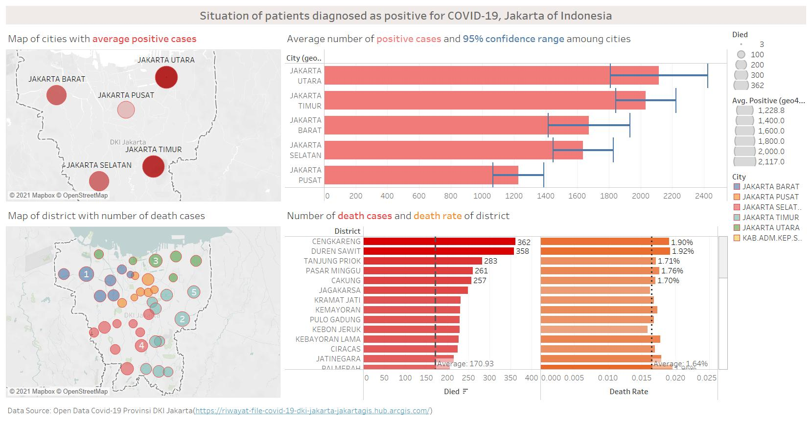

```{r setup, include=FALSE}
knitr::opts_chunk$set(echo = FALSE)
```

# 1. Original Visualization


The orignal visualization reflect the death cases and positive cases situation in Jakarta. The data source is from [Open Data Covid-19 Provinsi DKI Jakarta](https://riwayat-file-covid-19-dki-jakarta-jakartagis.hub.arcgis.com/).For creating the data visualisation above, the file dated on **30 Juni 2021 Pukul 10.00** is used. The purpose of visualization is to prepare two data visualization to support the news write-up of the latest development in DKI Jakarta.

# 2. Critiques & Suggestions

## 2.1 Clarity 


- ***Improper annotation for top 5 districts: *** The annotations of top 5 districts are the district names which can't reflect the number of deaths and the annotations overlap the point of **CENGKENG**. Therefore, the annotation didn't help highlight top 5 districts and even make the visualization effect worse. The information readers can get from annotation is the name of top 5 highest districts which can be found easily on the Y-axis. 


- ***Improper X-axis title: *** The x-axis title of second visualization is misleading. It will make readers interpret wrongly about the level of cumulative positive cases data. It should also mentioned the data was grouped by city and should also show the variation of average cumulative data. 

## 2.2 Aethetics

- ***Improper Chart Type of Cumulative Deaths: *** Since the data is cumulative deaths, scatter plot can't help readers understand the deaths and hard to figure out the accurate number of deaths of different districts. Moreover, the scatter plot is also difficult for readers to find the point corresponding to each district. The scatter plot can't help readers to find insightful ideas about death cases.

# 3. Proposed Design

## 3.1 Sketch


## 3.2 Final Design



The address for this visualization on tableau public is [here](https://public.tableau.com/app/profile/zhen.li7736/viz/Book1_16270412233930/Dashboard1).

## 3.3 Advantage of Proposed Design


# 4. Main Observations

# 5. Data Visualization Process

## 5.1 Data Preparation

1. The origin dataset is as following:


2. Delete the NA values.


3. Get the longitude and latitude for districts and cities by Jupyter Notebook.


4. Extract clean data for sub-districts.


## 5.2 Map - city

## 5.3 Map - district

## 5.4 Average number of positive cases in cities

## 5.5 Number of death and death rate in districts

## 5.6 Funnel chart for death rate and positive cases

## 5.7 Dashboard


